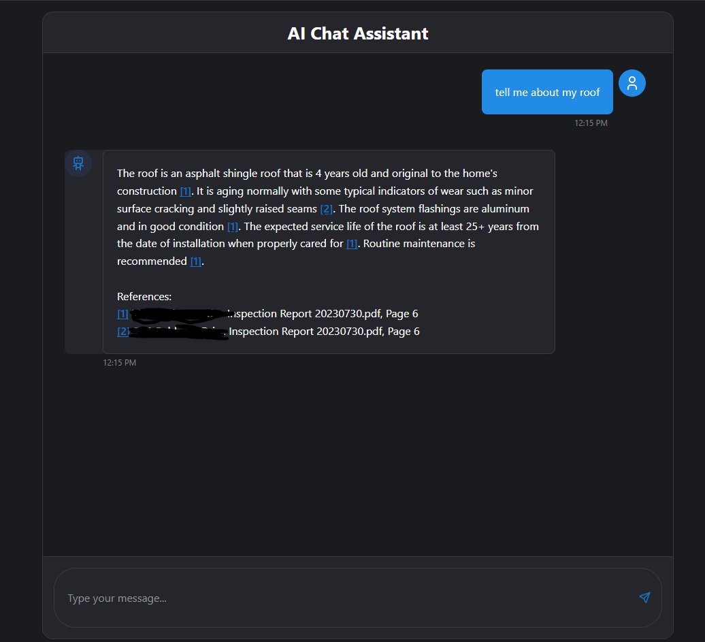

# Simple RAG Chatbot

A modern, responsive chatbot application that uses Retrieval-Augmented Generation (RAG) to provide accurate, context-aware responses based on your PDF documents. Built with Google's Gemini AI, ChromaDB, and a React + Flask stack.




## Features

- 📄 PDF Document Processing: Upload and process PDF documents for contextual information
- 🔍 Smart Retrieval: Uses ChromaDB vector store for efficient semantic search
- 🤖 Advanced AI Responses: Powered by Google's Gemini AI model
- 💬 Real-time Chat Interface: Modern React-based UI with streaming responses
- 📚 Source Citations: Automatic citation of sources with page numbers
- 🎯 Context-Aware: Responses are based on your document content

## Architecture

### Backend Components

- **Flask Server**: REST API handling document processing and chat endpoints
- **Document Processor**: Manages PDF processing and vector storage
- **Gemini AI**: Google's latest LLM for generating responses
- **ChromaDB**: Vector database for efficient semantic search
- **LangChain**: Framework for connecting various components

### Frontend Components

- **React + TypeScript**: Modern frontend framework
- **Real-time Updates**: Server-Sent Events for streaming responses
- **Responsive Design**: Modern UI that works on all devices

## Setup Instructions

### Prerequisites

- Python 3.8+
- Node.js 16+
- Google Cloud API key with Gemini API access

### Backend Setup

1. Create a Python virtual environment:
   
   **Command Line:**
   ```bash
   python -m venv .venv
   ```
   
   **VS Code:**
   - Press `Ctrl+Shift+P` (Windows) or `Cmd+Shift+P` (Mac)
   - Type "Python: Create Environment"
   - Select "Venv"
   - Choose your Python interpreter

2. Activate the virtual environment:
   - Windows:
     ```powershell
     .\.venv\Scripts\activate
     ```
   - Unix/MacOS:
     ```bash
     source .venv/bin/activate
     ```

3. Install Python dependencies:
   ```bash
   cd backend
   pip install -r requirements.txt
   ```

4. Create a `.env` file in the backend directory (or rename example.env to .env and fill in your API key):
   ```
   GOOGLE_API_KEY=your_google_api_key_here
   ```

### Frontend Setup

1. Install Node.js dependencies and build the application:
   ```bash
   cd frontend
   npm install
   npm run build
   ```

### Data Setup

1. Create a data directory structure:
   ```
   data/
   ├── source_files/    # Place your PDF files here
   └── vector_db/       # Will store the vector embeddings
   ```

2. Place your PDF documents in the `data/source_files` directory

3. Index your documents:
   ```bash
   cd backend
   python document_processor.py
   ```

### Running the Application

1. Start the application using the provided script:
   ```bash
   cd backend
   ./start.ps1
   ```
   This script will handle both the backend server startup and serve the built frontend.

2. Open your browser and navigate to `http://localhost:5000`

## Usage

1. Place your PDF documents in the `data/source_files` directory
2. Process the documents using the UI or API endpoint
3. Start chatting! Ask questions about your documents
4. The system will provide responses with citations to specific pages in your documents

## Project Structure

```
.
├── backend/
│   ├── app.py                 # Main Flask application
│   ├── document_processor.py  # PDF processing and vector storage
│   └── requirements.txt       # Python dependencies
├── frontend/
│   ├── src/
│   │   ├── components/       # React components
│   │   └── App.tsx          # Main React application
│   └── package.json         # Node.js dependencies
└── data/
    ├── source_files/        # PDF documents
    └── vector_db/          # ChromaDB storage
```

## Contributing

Feel free to submit issues and enhancement requests!

## License

[Add your chosen license here]